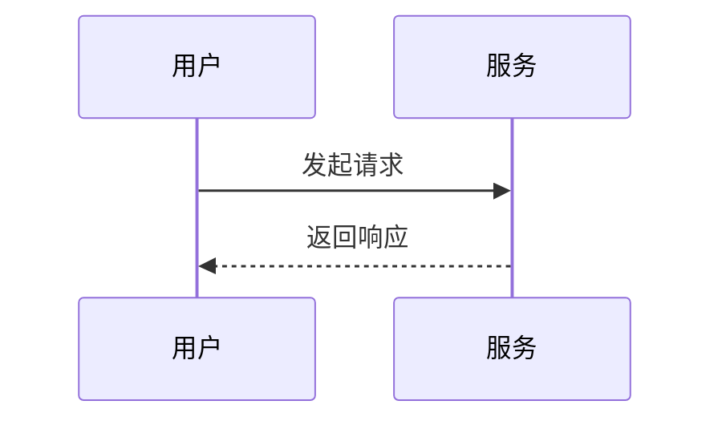

# 标题

**加粗**与*斜体*，[链接](https://example.com)。

| 列A | 列B |
|---|---|
| 1 | 2 |

- [x] 任务一
- [ ] 任务二

```js
console.log('code block')
```

Mermaid 围栏（md 内的 ```mermaid 代码块渲染为图）：


```mermaid
sequenceDiagram
  participant U as 用户
  participant S as 服务
  U->>S: 发起请求
  S-->>U: 返回响应
```
